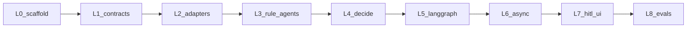

# Graded implementation of LLD-MVP

You are new to multi-agent orchestration. The LLD already has a 7-step build order ([LLD-MVP.md](../../docs/LLD-MVP.md) §20). This plan **reorders that work into nine learning slices** so each slice teaches one idea and leaves you with something you can run or test.

**Product phases in [PLAN.md](../../docs/PLAN.md) stay as-is.** Those are MVP vs hardening vs final. The slices below are _how you learn while building MVP only_.

After you approve this plan, the first code change is a short [IMPLEMENTATION.md](IMPLEMENTATION.md) at the repo root (learner checklist). Then we implement **one slice per session**. Doing all nine in one go is a large token/time cost; do not batch them.

**Why this order:** agents are typed functions first. The graph is just those functions in a state machine. The queue is just “run the graph later.” The LLM is optional. The UI is the last mile. If you start with LangGraph + Celery + GPT together, you cannot tell which layer failed.

---

## What you will learn (map)

| Slice | Concept                                    | You can ignore until later |
| ----- | ------------------------------------------ | -------------------------- |
| L0    | API process, env, DB, health               | Agents, UI, LLM            |
| L1    | Pydantic as the contract; audit as history | Graph, Celery              |
| L2    | Adapters hide the outside world            | LLM                        |
| L3    | An “agent” is a function + schema          | LangGraph, workers         |
| L4    | Orchestrator owns the decision (LLD §7)    | Human UI                   |
| L5    | Sequential graph + checkpoints             | Redis queue                |
| L6    | HTTP 202 + worker + isolation              | Specialist screens         |
| L7    | HITL on every claim                        | Phase 2 HIPAA              |
| L8    | Golden evals in rules mode                 | Live payer APIs            |

---

## L0 — Scaffold (day 1)

**Learn:** this is a Python service, not “AI yet.”

**Build:**

- Layout from LLD §5: `backend/claim360/`, `web/` placeholder optional, `fixtures/`, `prompts/`, `evals/`
- `uv` + Python 3.12, FastAPI `GET /health`, pydantic-settings, `.env.example` from LLD §17
- Homebrew Postgres + Redis; Alembic empty revision or just `claims` stub later in L1
- `GET /ready` can wait until L1 if DB models are not there yet (`/health` is enough)

**Done when:** `uvicorn` returns `{ "status": "ok" }` and you can `psql` / `redis-cli ping`.

---

## L1 — Contracts and persistence

**Learn:** if I/O is not typed, multi-agent systems become un-debugable.

**Build:**

- Pydantic: claim payload (LLD §8.2), three agent outputs + letter (LLD §9), status enum (LLD §6.1)
- SQLAlchemy tables: `claims`, `agent_findings`, `audit_events`, `users` (LLD §8.1)
- Seed specialist user from env
- Insert-only audit helper: `append_audit(claim_id, event_type, actor, payload)`

**Done when:** pytest creates a claim row and an audit event; no agent logic yet.

---

## L2 — Fixture adapters

**Learn:** agents never open files or call the internet. They call interfaces.

**Build:** JSON under `fixtures/` and adapters in [backend/claim360/adapters](backend/claim360/adapters) (LLD §10). Unknown member → data the Policy agent can turn into `needs_clarification` (do not crash).

**Done when:** unit tests load `MEM-001` eligibility/history/guidelines without FastAPI.

---

## L3 — Rules-only agents (no LLM, no graph)

**Learn:** Policy / Fraud / MedNec are interchangeable modules. LLM is a later implementation of the same contract.

**Build:** `agents/policy.py`, `fraud.py`, `mednec.py` using fixtures + `LLM_ENABLED=false` rules. Persist `agent_findings`. Pydantic-validate every output.

**Done when:** you can call each agent in pytest and get schema-valid JSON for one synthetic claim.

---

## L4 — Deterministic aggregation + letter template

**Learn:** the orchestrator adjudicates; agents do not (see `.cursor/rules/agents-orchestration.mdc`).

**Build:** `formulate_decision` exactly as LLD §7. Template letter from decision + findings (no LLM). Four fixture claims that hit approve / deny-policy / pend-fraud / deny-mednec.

**Done when:** a single Python function `adjudicate_sync(claim_id)` runs Policy → Fraud → MedNec → decide → template letter → writes `PROPOSED` fields. This is your “mental model of the graph” before LangGraph exists.

---

## L5 — LangGraph sequential machine

**Learn:** nodes, state, edges, retries, checkpoints. Same functions as L4, now a graph.

**Build:** nodes from LLD §6.2: `load_claim` → `policy_agent` → `fraud_agent` → `mednec_agent` → `formulate_decision` → `draft_letter` → `persist_proposed`. Status transitions. Node retry max 3; then `FAILED_ESCALATED`. Checkpointer: Postgres (not `MemorySaver` for the real path). Redis lock `lock:claim:{id}` can wait until L6 if you only run one claim locally.

**Done when:** you invoke the graph from a script/`pytest` for one `claim_id` and status ends `AWAITING_HUMAN`.

---

## L6 — FastAPI intake + Celery

**Learn:** the API must not wait for agents (NFR ack ≤ 30s). One workflow per `claim_id`.

**Build:** `POST /api/v1/portal/claims` (portal key, 202, 409 on duplicate), enqueue `orchestrate_claim`, Celery time limits, idempotent no-op if already `AWAITING_HUMAN+`. `GET /portal/claims/{id}` status. Redis lock around the graph. structlog with `claim_id`.

**Done when:** `curl` intake returns in milliseconds; worker logs three agents; `GET` shows `AWAITING_HUMAN`. Two curls do not mix payloads.

---

## L7 — HITL APIs + specialist UI

**Learn:** human review is required on every claim; the graph stops at `AWAITING_HUMAN`.

**Build:** JWT login, queue/detail/patch/approve/escalate/audit (LLD §11.2). Approve → `FINALIZED` + payment/comms stubs + `specialist_feedback`. React + Vite screens (LLD §12): login, queue, workspace (claim + three cards + letter + Approve/Escalate), audit.

**Done when:** you approve one claim in the browser; portal GET returns RESPONSE; audit timeline is complete. Browser-verify the flow (login → queue → workspace → approve → audit).

---

## L8 — LLM optional + golden CI

**Learn:** LLM is a replaceable writer behind the same schemas; CI stays deterministic.

**Build:** versioned prompts under `prompts/`; `instructor` or structured output; kill switch still works. `evals/golden` four cases; `pytest evals/` with `LLM_ENABLED=false`. GitHub Actions: ruff + pytest. README: Homebrew + three processes (API, worker, UI).

**Done when:** CI is green without API keys; flipping `LLM_ENABLED=true` only changes letter/rationale quality, not the aggregation table.

---

## Rules we will not break (any slice)

- Sequential agents only; no CrewAI/AutoGen; no Docker Compose; no live payer/email.
- Agents stay in-process in the worker.
- LLD-MVP.md wins if this checklist and the LLD disagree.

## Suggested session cadence

| Session | Slice   | Rough size                                 |
| ------- | ------- | ------------------------------------------ |
| 1       | L0      | Small                                      |
| 2       | L1 + L2 | Medium                                     |
| 3       | L3 + L4 | Medium (this is the “aha” for multi-agent) |
| 4       | L5      | Medium                                     |
| 5       | L6      | Medium                                     |
| 6       | L7      | Large (UI)                                 |
| 7       | L8      | Small                                      |

---

## After you approve

1. Add [IMPLEMENTATION.md](IMPLEMENTATION.md) with this slice list and a checkbox “done when.”
2. Stop and wait for you to say **start L0** (or L0–L1 together).
