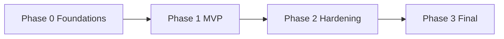

# Claim360 AI — MVP and Final Phase Plan

**Companion to:** [REQUIREMENTS.md](./REQUIREMENTS.md) v1.2, [LLD-MVP.md](./LLD-MVP.md)  
**Date:** 2026-08-29  
**Goal:** Ship a working adjudication loop first; complete Exhibit 22.3 + evaluation/ops in later phases.

---

## 1. Planning principles

1. **Vertical slice, not a platform first.** MVP proves intake → three specialist agents → proposed decision + draft letter → human review → recorded disposition. Integrations and HIPAA-grade ops come after the loop works.
2. **Human review is mandatory in MVP.** Matches Open Question 1. No auto-adjudication until quality metrics exist.
3. **Mock the world, keep agent contracts real.** Eligibility, history, guidelines, and payment are fakes or fixtures in MVP; agent I/O schemas stay production-shaped so swaps are not rewrites.
4. **Evaluation is a thin gate in MVP, a product in Final.** Offline golden set + structured outputs now; drift, canary, safe mode, and dashboards later.

---

## 2. Phase overview

| Phase | Name | Outcome | Suggested duration* |
|-------|------|---------|---------------------|
| **0** | Foundations | Repo, claim/decision schemas, local run, secrets pattern | 1 week |
| **1** | **MVP** | End-to-end demo on synthetic claims; specialist workspace | 4–6 weeks |
| **2** | Hardening | Real APIs (or certified stubs), retries/queues, RBAC, audit completeness | 4–6 weeks |
| **3** | **Final** | Payment, member/provider comms, eval/monitoring product, remaining Should/Could | 6–10 weeks |

\*Durations assume a small team (2–4). Adjust to class/project constraints; keep the **same sequence**.



---

## 3. MVP (Phase 1) — what “done” means

A specialist can submit a **synthetic claim**, watch **Policy / Fraud / Medical Necessity** return structured findings, see a **proposed decision and draft member letter**, **edit and approve or escalate**, and inspect an **append-only audit trail**. Provider gets an **ack within ~30s** and a later **decision response** (async is OK).

### 3.1 In scope (Must, reduced)

| Area | MVP behavior | Requirement IDs |
|------|----------------|-----------------|
| Intake | REST (or simple portal mock) claim submit; Orchestrator owns the case | FR-01–FR-07, TR-03, TR-09 (mock portal) |
| Agents | Orchestrator + Policy + Fraud + Medical Necessity; sequential is fine | FR-08–FR-16, TR-01–TR-04 |
| Decision + draft | Approve / deny / partial / pend + policy-rationale draft | FR-17–FR-20, TR-15, TR-17 |
| Human review | Workspace: summary, three agent panels, edit decision/letter, approve, escalate | FR-21–FR-24, NFR-18, NFR-20 |
| Disposition | Record pay / deny / pend; **no live payment rail** (stub adapter) | FR-25–FR-28 (record + artifacts; payment = no-op + log) |
| Data | Fixtures: eligibility, member history, guidelines, prior treatments | FR-29, TR-11–TR-14 (local/store mocks) |
| Quality bar | JSON schema validation on agent outputs; HITL always | NFR-17, NFR-18 |
| Reliability (lite) | Per-claim ID, retry failed agent call 2–3 times, then escalate | FR-04, NFR-01–NFR-02 (in-process or simple queue) |
| Isolation | No shared mutable state across concurrent claims | NFR-06 |
| Audit | Append-only events: intake, each agent I/O, proposal, human edits, final | FR-28, NFR-14–NFR-15 |
| Versions | Tag each run: model/prompt/config ids (even if “v0-local”) | EVAL-27 (minimal) |
| Offline eval | Small golden set (tens of claims); fail CI if schema invalid or smoke suite fails | EVAL-01, EVAL-02, EVAL-04 (subset), NFR-19 |
| Feedback | Store specialist override + letter edit vs draft | EVAL-07, EVAL-26 (store only; no auto-retrain) |
| Security (dev) | TLS locally optional; env-based secrets; no PHI in git | TR-25; NFR-09–NFR-13 **not** production-certified |
| Observability | Claim-id logs; health endpoint | TR-24 (logs), NFR-23 (health + basic counts) |

### 3.2 Explicitly out of MVP

- Live eligibility / claims history / clinical / payment systems (TR-06–TR-10 production)
- HIPAA program, encryption-at-rest as a certified control, full RBAC product (NFR-09–NFR-13, NFR-16 production)
- Parallel agent fan-out (TR-05), SLA dashboards at 99.5% / 5 min (NFR-03–NFR-04, NFR-07–NFR-08)
- Conversational NLP with users (FR-30, TR-16), tool-navigation bots (FR-31, TR-18)
- Urgency routing, provider quality/location (FR-33–FR-34, TR-20–TR-21)
- Call bot (FR-35, TR-22–TR-23)
- Shadow/canary, drift, safe mode, rollback product, fairness slices (EVAL-06, EVAL-14–EVAL-24, EVAL-31)
- Auto-approve low-risk path (Open Question 1)
- Member portal UI (out of scope in requirements)

### 3.3 MVP architecture (keep it small)

```
[Payer portal mock] --POST /claims--> [API]
                                         |
                                    [Orchestrator]
                                    /     |      \
                              Policy   Fraud   MedNec
                                    \     |      /
                                    [Decision + draft]
                                         |
                              [Specialist UI] --> [Audit log]
                                         |
                              [Payment stub] + [Comms stub]
```

**Recommended stack (replace if the course mandates otherwise):** Python orchestrator + typed agent contracts (Pydantic); SQLite or Postgres for cases/audit; simple React or server-rendered specialist UI; LLM via one provider for rationale/drafts with **deterministic fallbacks** if the model is down.

**Agent run order (MVP):** sequential Policy → Fraud → Medical Necessity (matches §6.2). Parallelization is Phase 2/3.

### 3.4 MVP user stories (acceptance)

1. Submit claim → 202/ack with `claim_id` within 30 seconds; case appears in specialist queue.
2. All three agents persist schema-valid findings; invalid output is retried then escalated.
3. Orchestrator writes proposed decision + draft letter with policy citations from fixtures.
4. Specialist can edit decision and letter, approve, or escalate (second queue / flag).
5. Approve does **not** send email/SMS; it writes final artifacts and a stub “payment/disposition” event.
6. Audit viewer lists ordered events for that `claim_id`.
7. Two claims in parallel do not mix fields.
8. CI runs golden-set smoke (at least happy path, ineligible, high-fraud, not-medically-necessary).

### 3.5 MVP risks

| Risk | Mitigation |
|------|------------|
| LLM hallucinates policy | Ground drafts in fixture policy snippets; specialist must approve |
| Scope creep into real EHR/payer APIs | Freeze adapters behind interfaces |
| Eval theater | Golden set is small but **labeled** and in CI |

---

## 4. Phase 2 — Hardening (bridge to Final)

Do this **before** calling the system production-ready. Not a second MVP; it is the path from demo to operable product.

| Workstream | Deliverables | Requirement IDs |
|------------|--------------|-----------------|
| Integrations | Auth’d adapters (OAuth2/mTLS as needed); retries, DLQ, escalate | FR-29, TR-06–TR-09, TR-08, NFR-01–NFR-02 |
| Security | TLS, encryption at rest, RBAC (provider / specialist / admin), HIPAA handling plan | NFR-09–NFR-13, NFR-11–NFR-12, TR-26 |
| Audit | Immutable store + retention policy; no PHI in non-secure analytics | NFR-16, EVAL-25, EVAL-32 |
| Config | Fraud threshold and routing without full redeploy | NFR-24 |
| Agents | Optional parallel reviews; preserve audit order on aggregate | TR-05 |
| Ops | Metrics: throughput, latency, errors, escalation rate | NFR-23, EVAL-19 (ops subset) |
| Eval | Full per-agent offline suites + release gate vs baseline | EVAL-02–EVAL-05, EVAL-08–EVAL-12 (offline) |
| Change control | Documented promotion sign-off | EVAL-30 |

**Exit criteria:** A claims-quality owner can refuse a prompt/model change that fails the gate; specialists work only through RBAC; failed integrations do not drop claims.

---

## 5. Final phase (Phase 3) — complete product

Closes remaining Musts from requirements and the Should/Could items you choose to ship.

### 5.1 Must remaining after MVP + Hardening

| Workstream | Deliverables | Requirement IDs |
|------------|--------------|-----------------|
| Payment | Real payment (or certified sandbox) on approved pay disposition | FR-25, TR-10 |
| Communications | Human-reviewed **send** to member (and provider response with rationale) | FR-26–FR-27, FR-07, NFR-25–NFR-26 |
| NLP | Production-quality drafts still specialist-editable | TR-15, TR-17 |
| Error surfacing | Claim/workflow errors visible and correctable/escalatable | FR-32, TR-19 |
| Modular deploy | Independently deployable agents | NFR-22, NFR-07–NFR-08 |
| Eval product | Online metrics vs specialist labels; dashboards; alerts | EVAL-07, EVAL-13, EVAL-18, EVAL-21, EVAL-24 |
| Drift & guardrails | Input/output/concept drift; safe mode; rollback RTO | EVAL-14–EVAL-17, EVAL-22–EVAL-23 |
| Feedback loop | Refresh golden set; versioned eval history | EVAL-26, EVAL-28–EVAL-29 |
| Tracing | Centralized logs + per-claim traces + alerting | TR-24 |

### 5.2 Should / Could — prioritize after Musts

| Priority | Item | IDs |
|----------|------|-----|
| Should | Availability 99.5% business hours; ≤5 min agent SLA | NFR-03, NFR-04 |
| Should | Conversational NLP for configured users | FR-30, NFR-21, TR-16 |
| Should | Navigate payer/provider tools | FR-31, TR-18 |
| Should | Urgency / preferred timing | FR-33, TR-20 |
| Should | Provider quality/location | FR-34, TR-21 |
| Should | Shadow/canary promotion | EVAL-06 |
| Should | Score calibration alerts | EVAL-20 |
| Should | Fairness / disparate-impact slices | EVAL-31 |
| Could | Call bot + log outcomes on audit trail | FR-35, TR-22–TR-23 |

### 5.3 Optional later (explicitly post-Final)

- Low-risk **auto-approve** with sampling (FR-24 future path; Open Question 1)
- Full GL / credentialing / member portal (requirements out of scope)

### 5.4 Final-phase success (maps to §7 Acceptance Criteria)

- Portal submit → Orchestrator ack; three agents return structured findings.
- Proposed decision + draft with policy rationale; specialist review/edit/escalate.
- Approved pay hits payment system; deny/pend dispositions are correct.
- Final letter sent after human refine; provider RESPONSE includes outcome.
- Full lifecycle audit; eval gates block regressions; drift/safe-mode/rollback demonstrated; feedback used to refresh eval sets.

---

## 6. Requirement traceability (compact)

| ID prefix | MVP | Phase 2 | Final |
|-----------|-----|---------|-------|
| FR-01–24, 28, 32 | Core loop + HITL + audit + errors | — | Comms send, payment live |
| FR-25–27 | Stub disposition + stored artifacts | — | Live pay + send |
| FR-29 | Mock APIs | Real APIs | — |
| FR-30–31, 33–35 | Out | Out | Should/Could as prioritized |
| NFR-01–02, 06, 14–15, 17–20, 22–23 | Lite | Production | — |
| NFR-03–05, 07–08 | Ack only (NFR-05) | Scale/SLA | Full |
| NFR-09–13, 16, 25–26 | Dev hygiene | HIPAA/RBAC/retention | Notice/appeal language |
| TR-01–05, 11–15, 17, 19, 25 | Yes (seq. agents, mocks) | Parallel, real data | — |
| TR-06–10, 26 | Interfaces | Auth + portal | Payment |
| TR-16, 18, 20–23 | Out | Out | Should/Could |
| TR-24, 27 | Logs + smoke eval | — | Full §5 |
| EVAL-01–05, 07, 26–27 | Thin | Full offline gate | — |
| EVAL-06, 08–25, 28–32 | Out / store only | Partial metrics | Full monitoring product |

---

## 7. Suggested build order inside MVP

1. Claim and agent **schemas** + audit event model  
2. Orchestrator state machine (intake → agents → propose → human → finalize)  
3. Three agents against **fixtures** (rules + LLM drafts)  
4. Specialist UI (queue, detail, edit, approve, escalate)  
5. Portal mock + async job + provider RESPONSE payload  
6. Golden set + CI smoke  
7. Demo script: four labeled claims covering the four decision types  

---

## 8. Open questions that block Final (not MVP)

From REQUIREMENTS.md §8: auto-adjudication policy, parallel vs sequential in production, call-bot use cases, payer SLAs, jurisdiction, numeric eval/alert thresholds, golden-set de-identification. **MVP proceeds on current assumptions** (HITL always, sequential agents, US HIPAA later, call bot deferred).

---

## 9. Document control

| Version | Date | Changes |
|---------|------|---------|
| 1.0 | 2026-08-29 | Initial MVP vs Final plan from REQUIREMENTS.md v1.2 |
