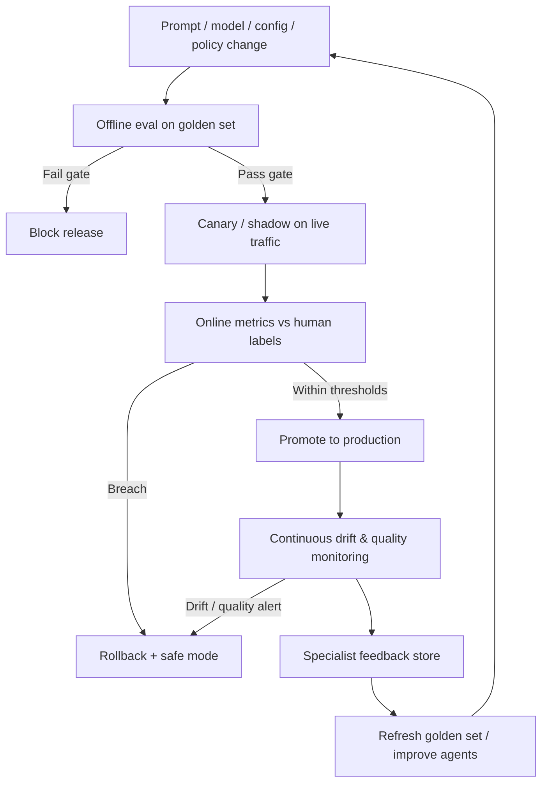
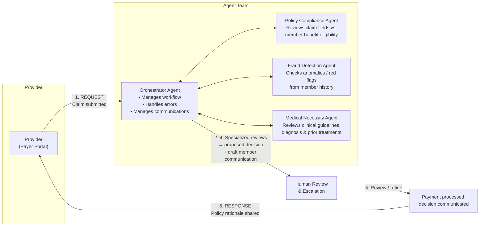
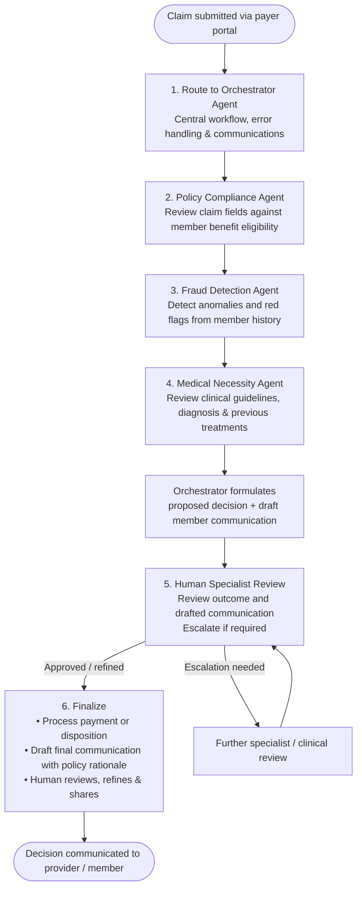
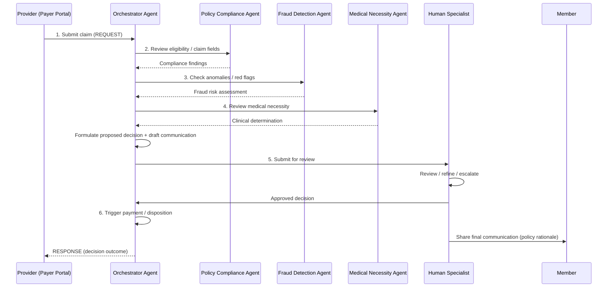

# Claim360 AI — Requirements Document

**System:** Agentic AI Workflow for Claims Adjudication and Communication of Review Outcome  
**Source:** Exhibit 22.3 — [Agentic AI workflow for claims adjudication and communication of review outcome](./IMG_1064.jpeg)  
**Primary Task:** Review a claim for validity, accuracy, and coverage  
**Version:** 1.0  
**Date:** 2026-08-29  

---

## 1. Introduction

### 1.1 Purpose

This document defines the functional, non-functional, and technical requirements for **Claim360 AI**, a multi-agent system that reviews insurance claims for validity, accuracy, and coverage; proposes adjudication decisions; drafts member communications; and supports human review before payment processing and final communication.

### 1.2 Scope

**In scope**

- Claim intake from the provider (payer portal)
- Orchestrated multi-agent review (policy compliance, fraud detection, medical necessity)
- Proposed decision and draft member communication
- Human specialist review and escalation
- Payment processing trigger and final decision communication with policy-based rationale
- Supporting agent services (APIs, NLP, contextual intelligence, call bot)

**Out of scope (unless later extended)**

- End-to-end claims accounting / general ledger
- Provider credentialing systems
- Full member portal UI (beyond communication delivery channels)
- Manual claim entry outside the payer portal integration

### 1.3 Stakeholders

| Stakeholder | Role |
|-------------|------|
| Provider | Submits claims via payer portal; receives responses |
| Payer / Claims operations | Owns adjudication policy and outcomes |
| Human specialist | Reviews AI outcomes and member communications |
| Member | Receives decision communications with rationale |
| System administrators | Configure integrations, agents, and monitoring |

### 1.4 System Actors

| Actor | Type | Description |
|-------|------|-------------|
| Provider (payer portal) | External | Submits claim requests and receives responses |
| Orchestrator Agent | AI | Central workflow, error handling, and communications manager |
| Policy Compliance Agent | AI | Reviews claim fields vs. member benefit eligibility |
| Fraud Detection Agent | AI | Detects anomalies and red flags from member history |
| Medical Necessity Agent | AI | Reviews clinical guidelines, diagnosis, and prior treatments |
| Human Specialist | Human | Reviews outcomes and draft communications; escalates as needed |

---

## 2. Functional Requirements

### 2.1 Claim Intake and Orchestration

| ID | Requirement | Priority |
|----|-------------|----------|
| FR-01 | The system shall accept claim submission requests from the provider via the payer portal. | Must |
| FR-02 | Upon claim submission, the system shall route the claim to the Orchestrator Agent. | Must |
| FR-03 | The Orchestrator Agent shall centrally manage the end-to-end adjudication workflow for each claim. | Must |
| FR-04 | The Orchestrator Agent shall manage workflow errors (detection, logging, recovery/retry, and escalation when unrecoverable). | Must |
| FR-05 | The Orchestrator Agent shall manage communications between the provider and the agent team (request/response). | Must |
| FR-06 | The Orchestrator Agent shall coordinate bidirectional interactions with the Policy Compliance, Fraud Detection, and Medical Necessity agents. | Must |
| FR-07 | The system shall return a response to the provider for each processed claim request. | Must |

### 2.2 Policy Compliance Review

| ID | Requirement | Priority |
|----|-------------|----------|
| FR-08 | The Policy Compliance Agent shall review specified claim fields against the member’s benefit eligibility. | Must |
| FR-09 | The Policy Compliance Agent shall produce a structured compliance result (e.g., eligible / ineligible / partial / needs clarification) with supporting field-level findings. | Must |
| FR-10 | The Policy Compliance Agent shall return its findings to the Orchestrator Agent for inclusion in the proposed decision. | Must |

### 2.3 Fraud Detection Review

| ID | Requirement | Priority |
|----|-------------|----------|
| FR-11 | The Fraud Detection Agent shall analyze the claim for anomalies and red flags using the specific member’s historical data. | Must |
| FR-12 | The Fraud Detection Agent shall return a fraud risk assessment (e.g., risk score/level and flagged indicators) to the Orchestrator Agent. | Must |
| FR-13 | Claims with high fraud risk shall be marked for human review / escalation. | Must |

### 2.4 Medical Necessity Review

| ID | Requirement | Priority |
|----|-------------|----------|
| FR-14 | The Medical Necessity Agent shall review the claim against clinical guidelines. | Must |
| FR-15 | The Medical Necessity Agent shall evaluate diagnosis and previous treatments relevant to the claim. | Must |
| FR-16 | The Medical Necessity Agent shall return a medical necessity determination with rationale to the Orchestrator Agent. | Must |

### 2.5 Decision Formulation and Draft Communication

| ID | Requirement | Priority |
|----|-------------|----------|
| FR-17 | Based on outputs from the specialized agents, the Orchestrator Agent shall formulate a proposed adjudication decision (e.g., approve, deny, partially approve, pend). | Must |
| FR-18 | The Orchestrator Agent shall draft a communication for the member reflecting the proposed decision. | Must |
| FR-19 | Draft and final communications shall include a detailed rationale based on applicable policy. | Must |
| FR-20 | The proposed decision and draft member communication shall be packaged for human specialist review. | Must |

### 2.6 Human Review and Escalation

| ID | Requirement | Priority |
|----|-------------|----------|
| FR-21 | A human specialist shall be able to review the AI-generated outcome and the drafted member communication. | Must |
| FR-22 | The human specialist shall be able to refine (edit) the decision and/or the communication before finalization. | Must |
| FR-23 | The system shall support escalation paths when specialist review determines further action is required. | Must |
| FR-24 | The system shall not finalize payment processing or member communication until human review is completed (unless explicitly configured otherwise for low-risk auto-approve paths in a future release). | Must |

### 2.7 Payment Processing and Final Communication

| ID | Requirement | Priority |
|----|-------------|----------|
| FR-25 | After human review and approval of the decision, the system shall support processing of payment (or denial/pend disposition as applicable). | Must |
| FR-26 | The agent shall draft final communication with a detailed policy-based rationale. | Must |
| FR-27 | A human shall review, refine, and share the final communication with the member. | Must |
| FR-28 | The system shall record the final decision, rationale, and communication artifacts for auditability. | Must |

### 2.8 Additional Agent Services (Functional Capabilities)

| ID | Requirement | Priority |
|----|-------------|----------|
| FR-29 | Agents shall connect to required databases and systems via APIs to retrieve eligibility, history, clinical, and related claim data. | Must |
| FR-30 | The system shall provide natural language capabilities to interact with users (providers, specialists, and/or members as configured). | Should |
| FR-31 | Agents shall navigate payer/provider tools as needed to complete review tasks. | Should |
| FR-32 | Agents shall identify errors in claim or workflow data and surface them for correction or escalation. | Must |
| FR-33 | Agents shall recognize urgency (e.g., time-sensitive claims) and preferred timings for actions/communications. | Should |
| FR-34 | Agents shall be able to check provider quality and/or location attributes when relevant to adjudication or routing. | Should |
| FR-35 | The system shall support a call bot capable of making automated phone calls (e.g., for outreach or status communication). | Could |

---

## 3. Non-Functional Requirements

### 3.1 Reliability and Availability

| ID | Requirement | Priority |
|----|-------------|----------|
| NFR-01 | The Orchestrator shall ensure claims are not lost due to transient agent or integration failures (durable queuing / retry). | Must |
| NFR-02 | Failed agent invocations shall be retried with bounded backoff; persistent failures shall escalate to human review. | Must |
| NFR-03 | Target availability for claim intake and orchestration services: ≥ 99.5% during business hours (configurable). | Should |

### 3.2 Performance

| ID | Requirement | Priority |
|----|-------------|----------|
| NFR-04 | The system shall complete automated agent reviews (policy, fraud, medical necessity) within a defined SLA (target: ≤ 5 minutes for standard claims under normal load). | Should |
| NFR-05 | Provider request/response acknowledgements shall return within a short timeout window (target: ≤ 30 seconds for acceptance/ack; full adjudication may be asynchronous). | Must |
| NFR-06 | The system shall support concurrent processing of multiple claims without cross-claim state leakage. | Must |

### 3.3 Scalability

| ID | Requirement | Priority |
|----|-------------|----------|
| NFR-07 | The architecture shall scale horizontally for orchestrator and specialized agent workloads as claim volume grows. | Should |
| NFR-08 | Specialized agents shall be independently scalable (policy, fraud, medical necessity). | Should |

### 3.4 Security and Privacy

| ID | Requirement | Priority |
|----|-------------|----------|
| NFR-09 | All PHI/PII in transit shall be encrypted (TLS 1.2+). | Must |
| NFR-10 | All PHI/PII at rest shall be encrypted. | Must |
| NFR-11 | Access to claim data, decisions, and communications shall be role-based (provider, specialist, admin). | Must |
| NFR-12 | Agent and human actions shall be authenticated and authorized for each data access. | Must |
| NFR-13 | The system shall comply with applicable healthcare privacy regulations (e.g., HIPAA) for handling of protected health information. | Must |

### 3.5 Auditability and Traceability

| ID | Requirement | Priority |
|----|-------------|----------|
| NFR-14 | Every claim shall have a full audit trail: intake, each agent input/output, proposed decision, human edits, final decision, and communications sent. | Must |
| NFR-15 | Agent decisions shall include explainable rationale suitable for specialist review and member communication. | Must |
| NFR-16 | Audit logs shall be immutable (append-only) and retained per regulatory retention policy. | Must |

### 3.6 Accuracy and Quality

| ID | Requirement | Priority |
|----|-------------|----------|
| NFR-17 | Agent outputs shall be structured and validated against defined schemas before orchestrator aggregation. | Must |
| NFR-18 | Human-in-the-loop review is required for finalization to mitigate incorrect automated adjudications. | Must |
| NFR-19 | The system shall support feedback capture from specialists to improve future agent performance (see Section 5). | Must |

### 3.7 Usability

| ID | Requirement | Priority |
|----|-------------|----------|
| NFR-20 | Human specialists shall have a clear UI/workspace showing claim summary, each agent’s findings, proposed decision, and editable draft communication. | Must |
| NFR-21 | Natural language interactions (where enabled) shall be understandable to non-technical users. | Should |

### 3.8 Maintainability and Operability

| ID | Requirement | Priority |
|----|-------------|----------|
| NFR-22 | Agents shall be modular and independently deployable/updatable. | Must |
| NFR-23 | The system shall expose health checks and operational metrics (throughput, latency, error rates, escalation rates). | Must |
| NFR-24 | Configuration of policies, thresholds (e.g., fraud risk), and routing rules shall be manageable without full redeploy where practical. | Should |

### 3.9 Compliance

| ID | Requirement | Priority |
|----|-------------|----------|
| NFR-25 | Adjudication rationales referenced in member communications shall be consistent with documented policy rules. | Must |
| NFR-26 | Member communications shall meet applicable notice and appeal-language requirements as configured by the payer. | Should |

---

## 4. Technical Requirements

### 4.1 Architecture

| ID | Requirement | Priority |
|----|-------------|----------|
| TR-01 | The system shall implement a multi-agent architecture with a central Orchestrator Agent and specialized agents for Policy Compliance, Fraud Detection, and Medical Necessity. | Must |
| TR-02 | Communication between Orchestrator and specialized agents shall be bidirectional (request findings; return results). | Must |
| TR-03 | The provider integration shall follow a request/response pattern via the payer portal. | Must |
| TR-04 | The workflow shall support the sequential logical stages: Intake → Policy → Fraud → Medical Necessity → Propose decision/draft → Human review → Payment & final communication. | Must |
| TR-05 | Specialized agent reviews may execute sequentially or in parallel under orchestrator control, provided final aggregation preserves dependency and audit order. | Should |

### 4.2 Integration and Connectivity

| ID | Requirement | Priority |
|----|-------------|----------|
| TR-06 | The system shall provide APIs to connect to required databases and external systems (eligibility, claims history, clinical guidelines, provider data, payment systems). | Must |
| TR-07 | API integrations shall support authentication (e.g., OAuth2 / mTLS as appropriate per system). | Must |
| TR-08 | Integration failures shall be handled with retries, dead-letter/error queues, and escalation to the Orchestrator / human review. | Must |
| TR-09 | The system shall integrate with the payer portal for claim intake and provider responses. | Must |
| TR-10 | The system shall integrate with payment processing systems to execute approved payment dispositions. | Must |

### 4.3 Data and Knowledge

| ID | Requirement | Priority |
|----|-------------|----------|
| TR-11 | Policy Compliance Agent shall access member benefit eligibility data. | Must |
| TR-12 | Fraud Detection Agent shall access member-specific historical claims/utilization data. | Must |
| TR-13 | Medical Necessity Agent shall access clinical guidelines, diagnosis data, and previous treatment records. | Must |
| TR-14 | Claim, decision, and communication data models shall be versioned and schema-validated. | Must |

### 4.4 NLP and Interaction

| ID | Requirement | Priority |
|----|-------------|----------|
| TR-15 | The system shall include NLP capabilities to generate and refine natural-language member/provider communications. | Must |
| TR-16 | Where enabled, agents shall support conversational natural-language interaction with users. | Should |
| TR-17 | Generated communications shall be editable by human specialists before send. | Must |

### 4.5 Contextual Intelligence

| ID | Requirement | Priority |
|----|-------------|----------|
| TR-18 | Agents shall have contextual knowledge to navigate payer/provider tools. | Should |
| TR-19 | Agents shall detect and report data/process errors. | Must |
| TR-20 | Agents shall evaluate urgency and preferred timings for processing and outreach. | Should |
| TR-21 | Agents shall query provider quality and location attributes when required by policy or routing rules. | Should |

### 4.6 Automation Channels

| ID | Requirement | Priority |
|----|-------------|----------|
| TR-22 | The system shall support a call bot for automated outbound phone calls. | Could |
| TR-23 | Automated call outcomes shall be logged and linked to the claim audit trail. | Could |

### 4.7 Observability, Error Handling, and Security Controls

| ID | Requirement | Priority |
|----|-------------|----------|
| TR-24 | Centralized logging, tracing (per claim ID), and alerting shall be implemented across orchestrator and agents. | Must |
| TR-25 | Secrets (API keys, credentials) shall be stored in a secrets manager; never in source code. | Must |
| TR-26 | All service-to-service calls within the agent team shall be authenticated. | Must |
| TR-27 | The system shall implement the evaluation, drift detection, and quality monitoring capabilities defined in Section 5. | Must |

---

## 5. Agent Evaluation and Monitoring Requirements

Agents can degrade over time due to model updates, prompt/config changes, shifting claim mix, policy changes, or data pipeline issues. The requirements below define how Claim360 AI shall **evaluate**, **monitor**, **detect drift**, and **respond** before quality impacts members or payment accuracy.

### 5.1 Evaluation Framework

| ID | Requirement | Priority |
|----|-------------|----------|
| EVAL-01 | The system shall maintain a versioned **golden evaluation dataset** of labeled claims covering policy compliance, fraud, medical necessity, and communication quality. | Must |
| EVAL-02 | Each agent (Orchestrator, Policy Compliance, Fraud Detection, Medical Necessity) shall have defined offline evaluation suites with pass/fail thresholds before promotion to production. | Must |
| EVAL-03 | Evaluation datasets shall be stratified by claim type, specialty, urgency, and risk band so performance is measured on meaningful slices—not only overall averages. | Must |
| EVAL-04 | Offline evaluation shall run automatically in CI/CD (or an equivalent release gate) on any change to prompts, models, tools, thresholds, or agent logic. | Must |
| EVAL-05 | A release shall be blocked if any agent’s offline metrics regress beyond configured thresholds versus the current production baseline. | Must |
| EVAL-06 | The system shall support **shadow / canary** evaluation: new agent versions process live claims without affecting the production decision until metrics meet promotion criteria. | Should |
| EVAL-07 | Human specialist final decisions and edits shall be treated as ground-truth signals for continuous online evaluation (agreement, override, edit distance). | Must |

### 5.2 Per-Agent Quality Metrics

| ID | Requirement | Priority |
|----|-------------|----------|
| EVAL-08 | **Policy Compliance Agent** shall be measured on: field-level agreement with specialist, false eligible / false ineligible rates, and clarification-request rate. | Must |
| EVAL-09 | **Fraud Detection Agent** shall be measured on: precision/recall (or proxy via specialist confirmation), score calibration, false-positive escalation rate, and missed high-risk rate on audited samples. | Must |
| EVAL-10 | **Medical Necessity Agent** shall be measured on: agreement with specialist/clinical review, overturn rate, and rationale sufficiency score (specialist-rated or rubric-based). | Must |
| EVAL-11 | **Orchestrator** shall be measured on: proposed-decision agreement with final decision, incomplete-aggregation rate, and communication draft acceptance / edit rate. | Must |
| EVAL-12 | **Member communication quality** shall be measured on: policy-rationale completeness, factual consistency with the decision, readability, and specialist edit rate / severity. | Must |
| EVAL-13 | System-level outcome metrics shall include: first-pass human approval rate, escalation rate, rework rate, appeal/overturn rate (where available), and average cycle time. | Must |

### 5.3 Drift Detection and Continuous Monitoring

| ID | Requirement | Priority |
|----|-------------|----------|
| EVAL-14 | The system shall monitor **input/data drift** (claim mix, diagnosis codes, provider patterns, eligibility distributions) versus a rolling baseline. | Must |
| EVAL-15 | The system shall monitor **output/prediction drift** (decision mix, fraud score distributions, necessity determinations, confidence scores) versus baseline. | Must |
| EVAL-16 | The system shall monitor **concept drift** proxies: rising human override rate, rising specialist edit severity, rising escalations, and rising post-decision appeals/overturns. | Must |
| EVAL-17 | Drift and quality metrics shall be computed per agent and per slice (claim type, specialty, payer product, urgency), not only globally. | Must |
| EVAL-18 | Monitoring dashboards shall show trends over configurable windows (e.g., daily / weekly / 30-day) with comparison to promotion baseline. | Must |
| EVAL-19 | Operational monitoring shall coexist with quality monitoring: latency, error rate, token/cost per claim, tool-call failure rate, and timeout rate per agent. | Must |
| EVAL-20 | Confidence / score calibration shall be tracked over time (e.g., fraud risk bands vs. confirmed outcomes) and alert when calibration degrades. | Should |

### 5.4 Alerting, Guardrails, and Remediation

| ID | Requirement | Priority |
|----|-------------|----------|
| EVAL-21 | Configurable alert thresholds shall trigger when quality or drift metrics breach limits (e.g., override rate ↑ X%, agreement ↓ Y%, fraud FP rate ↑ Z%). | Must |
| EVAL-22 | On critical quality alerts, the system shall support automatic **safe mode**: increase human-review sampling (up to 100%), disable canary versions, and/or route affected claim slices to specialists only. | Must |
| EVAL-23 | The system shall support **rollback** to the last known-good agent version (model, prompt, and config) within a defined RTO. | Must |
| EVAL-24 | Alerts shall notify operations and clinical/claims quality owners with claim-slice context and links to sample failing cases. | Must |
| EVAL-25 | Agents shall emit structured evaluation events (agent version, inputs hash, outputs, confidence, latency, human labels when available) for analytics—without exposing unnecessary PHI in non-secure stores. | Must |

### 5.5 Feedback Loop, Versioning, and Governance

| ID | Requirement | Priority |
|----|-------------|----------|
| EVAL-26 | Specialist overrides, free-text corrections, and communication edits shall be captured in a feedback store usable for evaluation set refresh and fine-tuning / prompt improvement. | Must |
| EVAL-27 | Every production agent run shall be tagged with immutable **version identifiers** (model ID, prompt version, tool schema version, policy-rule version). | Must |
| EVAL-28 | Evaluation results shall be stored per version to enable A/B comparison and audit of quality over time. | Must |
| EVAL-29 | Golden and online evaluation samples shall be periodically refreshed (target: at least quarterly, or sooner after major policy/benefit changes) to avoid stale benchmarks. | Must |
| EVAL-30 | A documented **model/agent change control** process shall require evaluation sign-off before production promotion. | Must |
| EVAL-31 | Fairness / disparate-impact monitoring shall track decision and override rates across protected or sensitive slices where legally appropriate and data allows. | Should |
| EVAL-32 | Evaluation and monitoring components themselves shall be covered by access control, audit logging, and retention policies consistent with Section 3. | Must |

### 5.6 Evaluation & Monitoring Flow (Reference)

---

## 6. Process Flow Diagram

### 6.1 End-to-End Claims Adjudication Flow

### 6.2 Detailed Step Sequence

### 6.3 Agent Interaction Model

**Step mapping**

1. Claim submitted → routed to Orchestrator (workflow, errors, communications).  
2. Policy Compliance Agent reviews claim fields vs. benefit eligibility.  
3. Fraud Detection Agent checks anomalies/red flags from member history.  
4. Medical Necessity Agent reviews guidelines, diagnosis, prior treatments → Orchestrator proposes decision + draft member communication.  
5. Human specialist reviews outcome and draft communication.  
6. Payment processed; final communication with policy rationale reviewed, refined, and shared.

---

## 7. Acceptance Criteria (High Level)

- A claim submitted via the payer portal is received by the Orchestrator and acknowledged to the provider.  
- Policy, fraud, and medical necessity agents each return structured findings for the claim.  
- Orchestrator produces a proposed decision and draft member communication with policy rationale.  
- Human specialist can review, edit, approve, or escalate before finalization.  
- Approved claims trigger payment processing (or correct non-pay disposition).  
- Final communication is human-reviewed and shared with detailed rationale.  
- Full audit trail exists for the claim lifecycle.  
- Additional services (API connectivity, NLP, contextual checks, optional call bot) are available as specified.  
- Offline evaluation gates block regressing agent releases; online drift/quality monitoring alerts and safe-mode/rollback behave as specified in Section 5.  
- Specialist overrides and edits are captured and usable for continuous evaluation.

---

## 8. Open Questions / Assumptions

| # | Item | Assumption / Question |
|---|------|------------------------|
| 1 | Auto-adjudication | Initial release requires human review for all claims; auto-approve for low-risk may be a later phase. |
| 2 | Parallel vs sequential agents | Orchestrator may run specialized agents in parallel for latency; confirm with operations. |
| 3 | Call bot scope | Optional (Could); confirm use cases (member outreach, provider callbacks, status). |
| 4 | SLA targets | Performance numbers are initial targets; confirm with payer SLAs. |
| 5 | Regulatory scope | HIPAA assumed for US healthcare claims; confirm jurisdiction-specific rules. |
| 6 | Eval thresholds | Exact pass/fail and alert thresholds (override %, agreement %, FP rate) to be set with claims quality owners. |
| 7 | Evaluation PHI | Confirm de-identification approach for golden sets and monitoring stores. |

---

## 9. Document Control

| Version | Date | Author | Changes |
|---------|------|--------|---------|
| 1.0 | 2026-08-29 | Claim360 AI | Initial requirements derived from Exhibit 22.3 workflow |
| 1.1 | 2026-08-29 | Claim360 AI | Added process flow diagrams |
| 1.2 | 2026-08-29 | Claim360 AI | Added agent evaluation, drift detection, and monitoring requirements (Section 5) |
